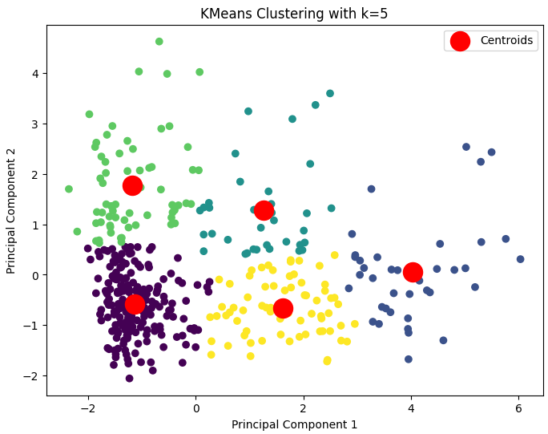
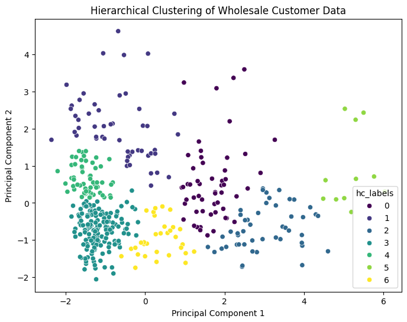

# Supervised Learning - Project

## Overview

This project performs an unsupervised learning analysis on a "Wholesale Data" dataset. The dataset contains information about the annual spending of clients of a wholesale distributor across various product categories. The project utilizes techniques like Exploratory Data Analysis (EDA), KMeans Clustering, Hierarchical Clustering, and Principal Component Analysis (PCA) to uncover patterns and insights within the data.

## Dataset

The dataset used in this project is the "Wholesale Customers Data Set" available on Kaggle. It can be accessed through the following link:

[Kaggle Link](https://www.kaggle.com/datasets/binovi/wholesale-customers-data-set)

## Project Structure

The project is divided into the following parts:

**Part I: EDA - Exploratory Data Analysis & Pre-processing:** This part focuses on understanding the data through visualizations, summary statistics, and data cleaning techniques. It involves handling missing values, identifying outliers, and exploring correlations between variables.

**Part II: KMeans Clustering:** This part utilizes the KMeans clustering algorithm to group similar products together based on their attributes. The Elbow method and silhouette analysis are employed to determine the optimal number of clusters.

**Part III: Hierarchical Clustering:** This part applies hierarchical clustering to build a hierarchy of clusters based on the similarity of data points. A dendrogram is generated to visualize the clustering structure and determine the optimal number of clusters.

**Part IV: PCA:** This part involves performing Principal Component Analysis (PCA) to reduce the dimensionality of the data while preserving the most important information. It identifies the principal components that capture the maximum variance in the data and helps in understanding the underlying structure.

**Part V: Conclusion:** This part summarizes the findings from the analysis, highlighting key insights and observations about the wholesale customer data.

## Requirements

To run this project, you will need the following libraries (as defined in `requirements.txt`):

- pandas
- numpy
- matplotlib
- seaborn
- scikit-learn
- scipy

You can install these libraries using `pip install -r requirements.txt`:

## Usage

1. Download the dataset from the Kaggle link provided above.
2. Save the dataset as 'Wholesale_Data.csv' in the same directory as the Jupyter Notebook.
3. Open the Jupyter Notebook and run the cells sequentially.

## Findings

The analysis of the wholesale customer data revealed the following key findings:

* **Strong correlations exist between product categories:** The EDA showed significant correlations between product categories, suggesting relationships between customer purchase patterns.
* **Outliers impact data distribution:** Outliers were identified and removed to ensure a more accurate analysis.
* **Two principal components explain significant variance:** PCA identified two components that explained a majority of the data's variability, providing a reduced-dimension representation.
* **KMeans and Hierarchical clustering suggest distinct customer segments:** Both clustering methods revealed the presence of distinct customer groups, offering insights into customer behavior.

* **5 Clusters based on Kmeans:**
* 

* **7 Clusters based on Dendrograms:**
* 

## Conclusion

This project provides a comprehensive unsupervised learning analysis of the wholesale customer data. By using a combination of EDA, clustering, and dimensionality reduction techniques, valuable insights were extracted about customer behavior and product relationships. This information can be used to make informed decisions in marketing, product placement, and customer segmentation.
